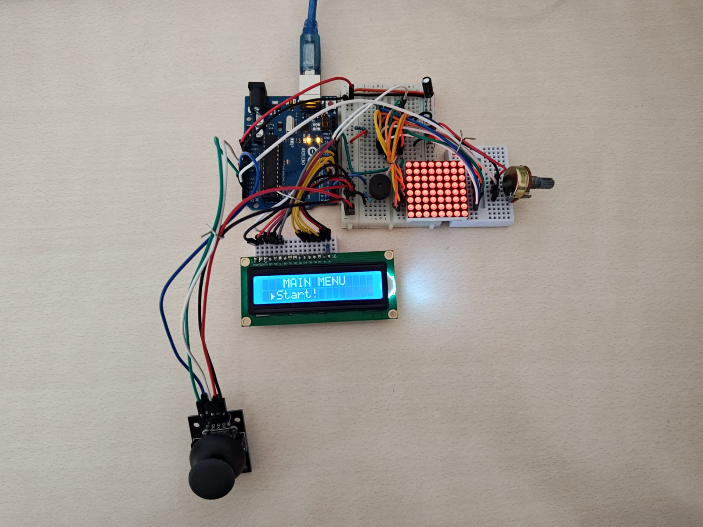

# IntroductionToRobotics-SnakeGame

# Snake Game

A classic Snake Game implemented on Arduino using an LCD, a LED matrix and  a joystick.

-> <a href="https://youtu.be/gFb9hsnGOSs">a short video presentation</a>
  

## Table of Contents
- [Introduction](#introduction)
- [Features](#features)
- [Hardware Components](#hardware-components)
- [Libraries Used](#libraries-used)
- [Controls](#controls)
- [How to Play](#how-to-play)
- [Gameplay](#gameplay)
- [Settings](#settings)

## Introduction

Welcome to my mini Snake Game for Arduino! This project brings the classic Snake game to life using a LED matrix and an LCD. Control the snake using the joystick and see how how many fruits you can collect.

## Features

- Classic Snake gameplay.
- Joystick controls.
- Leaderboard for top 3 plays.
- Buzzer for sound effects.
- Brightness adjustments using a potentiometer

## Hardware Components

- Arduino board
- LED matrix (8x8)
- LCD
- Joystick module (for controlling menu and game character)
- Potentiometer (for adjusting brightness)
- Buzzer (for sound effects)
- Wires and breadboard

## Libraries used

- LedControl.h (for LED matrix control)
- LiquidCrystal.h (for LCD display)
- EEPROM.h (for storing relevant data)

## Controls

- Use the joystick to navigate.
- Press the joystick button to make selections.

## How to Play

1. Power up your Arduino with the correct hardware connected.
2. Scroll through the menu.
3. Adjust settings if needed (settings will be saved after game restarts).
4. Watch information about the game's creator.
5. Press Start! and enjoy the Snake Game using the joystick.
6. Eat as many fruits as you can and avoid the walls. Your speed will become faster and faster, watch out!
7. Follow your live score and remaining lives on the display while playing.
8. After dying check out the leaderboard and if you made it.
9. Play again!

## Gameplay

Navigate the snake on the LED matrix, eat fruits to get a high score and avoid colliding with the walls. The game ends when the snake loses its' 3 lives.

## Settings

Feel free to set the game to suit your preferences. You can adjust the brightness or turn the sound ON/OFF.
